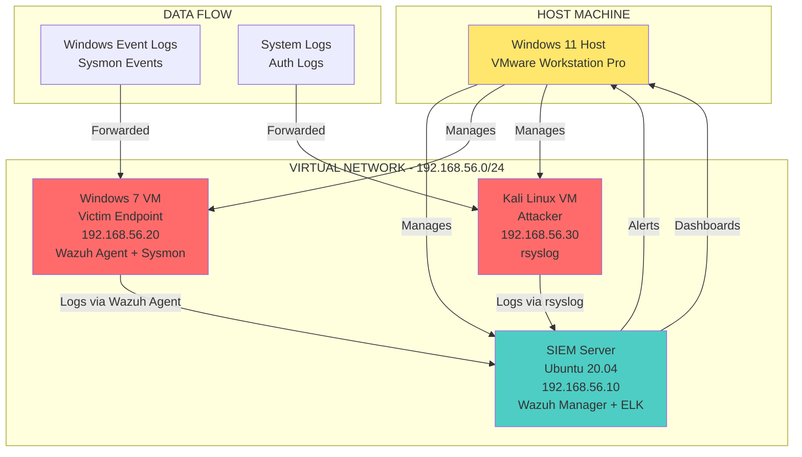
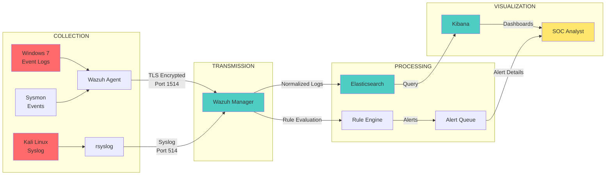
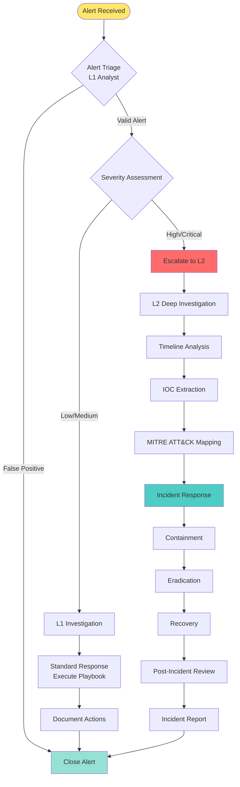
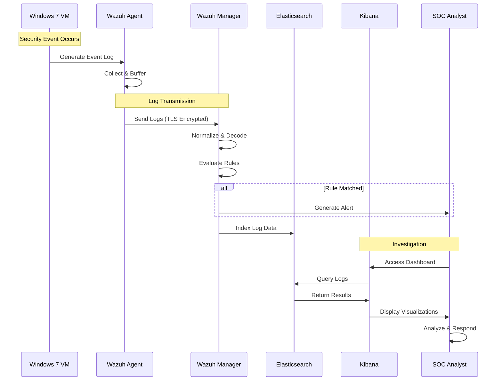

# SOC Architecture Diagrams

This file contains all architecture diagrams in various formats for easy reference and presentation.

---

## Network Topology Diagram (Mermaid)



---

## Data Flow Diagram (Mermaid)



---

## SOC Workflow Diagram (Mermaid)



---

## Component Interaction Sequence (Mermaid)



---

## Network Architecture (Detailed)

```
┌─────────────────────────────────────────────────────────────────────────┐
│                          VMWARE NETWORK ARCHITECTURE                      │
└─────────────────────────────────────────────────────────────────────────┘

HOST MACHINE (Windows 11)
│
├── VMware Workstation Pro
│   │
│   ├── VMnet1 (Host-Only Network)
│   │   ├── Subnet: 192.168.56.0/24
│   │   ├── Gateway: 192.168.56.1 (Host)
│   │   ├── DHCP: Disabled (Static IPs)
│   │   └── Internet: NO ACCESS
│   │
│   └── VMnet8 (NAT Network - Optional)
│       ├── Subnet: 192.168.100.0/24
│       ├── Gateway: 192.168.100.2
│       ├── NAT: Enabled
│       └── Internet: OUTBOUND ONLY
│
└── Virtual Machines
    │
    ├── SIEM Server (Ubuntu)
    │   ├── Host-Only IP: 192.168.56.10
    │   ├── NAT IP: 192.168.100.10 (if enabled)
    │   ├── Services:
    │   │   ├── Wazuh Manager: 1514/1515 (TLS)
    │   │   ├── Elasticsearch: 9200
    │   │   ├── Kibana: 5601
    │   │   └── Syslog: 514 (UDP)
    │   └── Firewall: UFW enabled
    │
    ├── Windows 7 VM (Victim)
    │   ├── Host-Only IP: 192.168.56.20
    │   ├── NAT IP: 192.168.100.20 (if enabled)
    │   ├── Services:
    │   │   ├── Wazuh Agent: Outbound to 192.168.56.10:1514
    │   │   ├── RDP: 3389 (for testing)
    │   │   └── Windows Event Log Service
    │   └── Firewall: Windows Firewall
    │
    └── Kali Linux VM (Attacker)
        ├── Host-Only IP: 192.168.56.30
        ├── NAT IP: 192.168.100.30 (if enabled)
        ├── Services:
        │   ├── SSH: 22
        │   ├── rsyslog: Forwarding to 192.168.56.10:514
        │   └── Attack Tools (Metasploit, etc.)
        └── Firewall: UFW enabled
```

---

## Port and Protocol Summary

| Service | Port | Protocol | Direction | Encryption |
|---------|------|----------|-----------|------------|
| Wazuh Agent → Manager | 1514 | TCP | Outbound | TLS |
| Wazuh Agent → Manager (Auth) | 1515 | TCP | Outbound | TLS |
| rsyslog → Wazuh | 514 | UDP/TCP | Outbound | Plain |
| Elasticsearch | 9200 | TCP | Local | None (internal) |
| Kibana | 5601 | TCP | Local | HTTP (no external) |
| RDP (Windows 7) | 3389 | TCP | Inbound | TLS |
| SSH (Kali) | 22 | TCP | Inbound | TLS |

---

## Security Zones

```
┌─────────────────────────────────────────────────────────┐
│              SECURITY ZONE CLASSIFICATION                │
└─────────────────────────────────────────────────────────┘

┌─────────────────────────┐
│  ZONE 1: ISOLATED LAB   │
│  (Host-Only Network)    │
│  Risk: LOW              │
│  Access: Internal Only  │
└─────────────────────────┘
         │
         ├── SIEM Server (192.168.56.10)
         ├── Windows 7 VM (192.168.56.20)
         └── Kali Linux VM (192.168.56.30)

┌─────────────────────────┐
│  ZONE 2: MANAGEMENT     │
│  (Host Machine)         │
│  Risk: LOW              │
│  Access: Local Only     │
└─────────────────────────┘
         │
         └── Windows 11 Host (VMware Workstation)

┌─────────────────────────┐
│  ZONE 3: INTERNET       │
│  (NAT Network - Optional)│
│  Risk: MEDIUM           │
│  Access: Outbound Only  │
└─────────────────────────┘
         │
         └── Only for updates/downloads when needed
```

---

These diagrams can be:
1. **Viewed in GitHub**: Mermaid diagrams render automatically in GitHub markdown
2. **Exported**: Use Mermaid Live Editor (https://mermaid.live) to export as PNG/SVG
3. **Embedded**: Include in presentations and documentation

