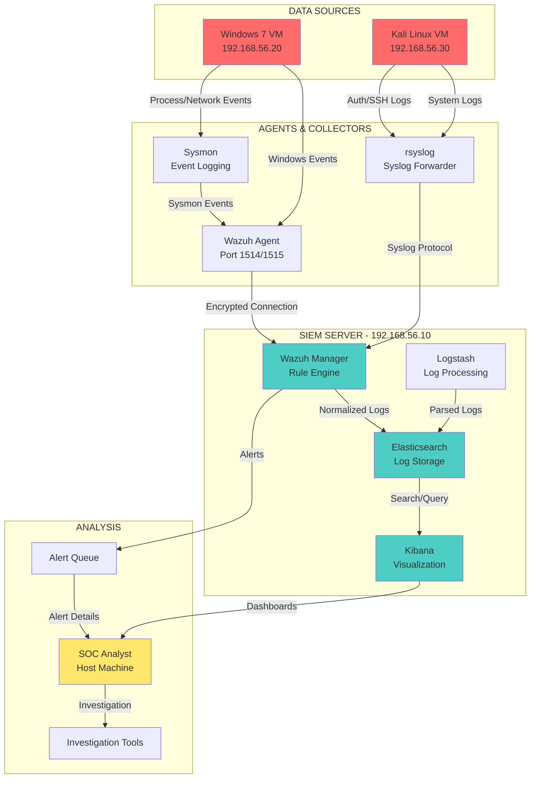
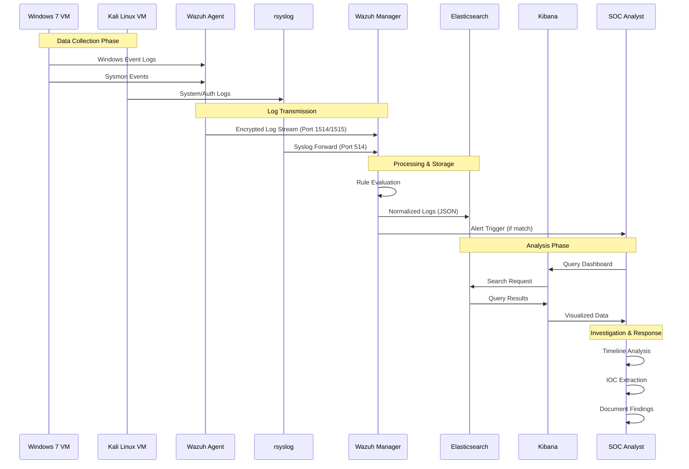

# PHASE 1: SOC Architecture Design

## Overview

This phase defines the complete architecture of our enterprise-grade SOC home lab, including network topology, data flows, component relationships, and organizational structure.

---

## 1. Architecture Diagram

### 1.1 High-Level Architecture (ASCII)

```
┌─────────────────────────────────────────────────────────────────────────────┐
│                         SOC HOME LAB ARCHITECTURE                            │
└─────────────────────────────────────────────────────────────────────────────┘

┌─────────────────────────────────────────────────────────────────────────────┐
│                           DATA COLLECTION LAYER                              │
├─────────────────────────────────────────────────────────────────────────────┤
│                                                                              │
│  ┌──────────────────────┐              ┌──────────────────────┐            │
│  │   Windows 7 (Victim) │              │  Kali Linux (Attacker)│            │
│  │   192.168.56.20      │              │   192.168.56.30       │            │
│  ├──────────────────────┤              ├──────────────────────┤            │
│  │ • Wazuh Agent        │              │ • rsyslog            │            │
│  │ • Sysmon             │              │ • SSH Logs           │            │
│  │ • Windows Event Logs │              │ • Auth Logs          │            │
│  │   - Security         │              │ • System Logs        │            │
│  │   - System           │              │                      │            │
│  │   - PowerShell       │              │                      │            │
│  └──────────┬───────────┘              └──────────┬───────────┘            │
│             │                                      │                        │
│             │     ┌──────────────────────┐        │                        │
│             │     │  Windows Events      │        │                        │
│             └─────┤  Sysmon Events       ├────────┘                        │
│                   │  Auth Logs           │                                  │
│                   │  SSH Logs            │                                  │
│                   └──────────┬───────────┘                                  │
│                              │                                              │
└──────────────────────────────┼──────────────────────────────────────────────┘
                               │
                               ▼
┌─────────────────────────────────────────────────────────────────────────────┐
│                           SIEM PROCESSING LAYER                              │
├─────────────────────────────────────────────────────────────────────────────┤
│                                                                              │
│  ┌──────────────────────────────────────────────────────────────────────┐  │
│  │                    SIEM Server (Ubuntu)                               │  │
│  │                    192.168.56.10                                      │  │
│  ├──────────────────────────────────────────────────────────────────────┤  │
│  │                                                                       │  │
│  │  ┌──────────────────┐  ┌──────────────────┐  ┌──────────────────┐   │  │
│  │  │  Wazuh Manager   │  │  Elasticsearch   │  │  Logstash        │   │  │
│  │  │  (Port 1514/1515)│  │  (Port 9200)     │  │  (Port 5044)     │   │  │
│  │  ├──────────────────┤  ├──────────────────┤  ├──────────────────┤   │  │
│  │  │ • Rule Engine    │  │ • Log Storage    │  │ • Log Processing │   │  │
│  │  │ • Alert Manager  │  │ • Indexing       │  │ • Parsing        │   │  │
│  │  │ • Agent Mgmt     │  │ • Search Engine  │  │ • Enrichment     │   │  │
│  │  └────────┬─────────┘  └────────┬─────────┘  └────────┬─────────┘   │  │
│  │           │                     │                      │             │  │
│  │           └─────────────────────┼──────────────────────┘             │  │
│  │                                 │                                    │  │
│  │  ┌──────────────────────────────────────────────────────┐           │  │
│  │  │              Kibana Dashboard                         │           │  │
│  │  │              (Port 5601)                              │           │  │
│  │  ├──────────────────────────────────────────────────────┤           │  │
│  │  │ • Alert Visualization                                 │           │  │
│  │  │ • Log Analysis                                        │           │  │
│  │  │ • Custom Dashboards                                   │           │  │
│  │  │ • Timeline Analysis                                   │           │  │
│  │  └──────────────────────────────────────────────────────┘           │  │
│  │                                                                       │  │
│  └──────────────────────────────────────────────────────────────────────┘  │
│                                                                              │
└──────────────────────────────────────┬───────────────────────────────────────┘
                                       │
                                       ▼
┌─────────────────────────────────────────────────────────────────────────────┐
│                           ANALYSIS & RESPONSE LAYER                          │
├─────────────────────────────────────────────────────────────────────────────┤
│                                                                              │
│  ┌──────────────────────────────────────────────────────────────────────┐  │
│  │                        SOC Analyst Workstation                        │  │
│  │                        (Host: Windows 11)                             │  │
│  ├──────────────────────────────────────────────────────────────────────┤   │
│  │                                                                       │   │
│  │  ┌──────────────┐  ┌──────────────┐  ┌──────────────┐               │   │
│  │  │  Alert       │  │  Investigation│  │  Documentation│               │   │
│  │  │  Triage      │  │  Tools        │  │  & Reporting  │               │   │
│  │  │  (L1/L2)     │  │  • Timeline   │  │  • Reports    │               │   │
│  │  │              │  │  • IOC Extract│  │  • Playbooks  │               │   │
│  │  └──────┬───────┘  └──────┬───────┘  └──────┬───────┘               │   │
│  │         │                 │                  │                        │   │
│  │         └─────────────────┼──────────────────┘                        │   │
│  │                           │                                           │   │
│  │  ┌──────────────────────────────────────────────────────┐            │   │
│  │  │         MITRE ATT&CK Mapping & IOC Database           │            │   │
│  │  └──────────────────────────────────────────────────────┘            │   │
│  │                                                                       │   │
│  └──────────────────────────────────────────────────────────────────────┘   │
│                                                                              │
└─────────────────────────────────────────────────────────────────────────────┘
```

### 1.2 Detailed Component Architecture (Mermaid)



### 1.3 Network Flow Diagram (Mermaid)



---

## 2. Data Flow Explanation

### 2.1 End-to-End Data Flow

The SOC data flow follows a standardized pipeline from log generation to analyst action:

```
LOG SOURCE → AGENT/COLLECTOR → SIEM PROCESSOR → STORAGE → VISUALIZATION → ANALYST
```

#### Step 1: Log Generation (Sources)

**Windows 7 (Victim):**
- **Windows Event Logs**: Security, System, Application, PowerShell logs
- **Sysmon Events**: Process creation, network connections, file modifications
- **Generated by**: Windows Event Log service, Sysmon driver

**Kali Linux (Attacker):**
- **System Logs**: `/var/log/syslog`, `/var/log/messages`
- **Authentication Logs**: `/var/log/auth.log`, SSH logs
- **Generated by**: rsyslog service, SSH daemon

#### Step 2: Log Collection (Agents)

**Windows 7:**
- **Wazuh Agent**: Collects Windows Event Logs via WinAPI
- **Sysmon**: Generates detailed process/network events → forwarded to Event Log
- **Collection Method**: Real-time streaming (pull-based)

**Kali Linux:**
- **rsyslog**: Collects local system logs
- **Collection Method**: File-based monitoring and forwarding

#### Step 3: Log Transmission

**Protocols:**
- **Wazuh Agent → Manager**: Encrypted TCP (Port 1514/1515) with TLS
- **rsyslog → Wazuh**: UDP/TCP Syslog (Port 514)

**Security:**
- TLS encryption for Wazuh agent communication
- Authentication via agent keys
- No cleartext transmission

#### Step 4: SIEM Processing (Wazuh Manager)

**Functions:**
1. **Log Normalization**: Convert to JSON format
2. **Rule Evaluation**: Match against detection rules
3. **Alert Generation**: Trigger alerts on rule match
4. **Enrichment**: Add context (geo-IP, asset info)

**Components:**
- **Rules Engine**: `/var/ossec/ruleset/rules/`
- **Decoders**: Parse and structure log data
- **Active Response**: Automated actions (optional)

#### Step 5: Storage (Elasticsearch)

**Functions:**
- **Indexing**: Store logs in time-based indices
- **Search**: Full-text and structured queries
- **Retention**: Configurable retention policies

**Index Pattern:**
- `wazuh-alerts-*`: Alert events
- `wazuh-events-*`: Raw log events

#### Step 6: Visualization (Kibana)

**Dashboards:**
- Security alerts overview
- Failed login attempts
- Top attacker IPs
- Timeline visualizations

#### Step 7: Analyst Action

**Workflow:**
1. Alert received → Triage (L1)
2. Investigation → Timeline analysis (L2)
3. IOC extraction → Threat hunting
4. Incident response → Containment/Eradication
5. Documentation → Report generation

---

## 3. SOC Roles & Responsibilities

### 3.1 Level 1 (L1) SOC Analyst

**Primary Responsibilities:**

1. **Alert Triage**
   - Monitor alert queue in real-time
   - Classify alerts by severity and type
   - Filter false positives
   - Escalate to L2 when needed

2. **Initial Analysis**
   - Verify alert authenticity
   - Check for known false positives
   - Gather basic context (IPs, usernames, timestamps)

3. **Documentation**
   - Log all actions in ticketing system
   - Create initial incident tickets
   - Update alert status

4. **Standard Response**
   - Execute playbooks for known scenarios
   - Block IPs in firewall (pre-approved)
   - Reset compromised accounts (per policy)

**Skills Required:**
- Understanding of SIEM tools (Wazuh/Kibana)
- Knowledge of common attack patterns
- Basic log analysis skills
- Incident ticket management

**Escalation Criteria:**
- High/Critical severity alerts
- Complex or novel attack patterns
- Potential data exfiltration
- Requires advanced investigation

---

### 3.2 Level 2 (L2) SOC Analyst / Threat Hunter

**Primary Responsibilities:**

1. **Deep Investigation**
   - Conduct timeline analysis
   - Correlate multiple data sources
   - Identify attack chain and root cause
   - Extract IOCs (Indicators of Compromise)

2. **Threat Intelligence**
   - Research threat actor TTPs
   - Map to MITRE ATT&CK framework
   - Check IOCs against threat feeds
   - Identify attribution (if applicable)

3. **Incident Response**
   - Coordinate containment actions
   - Lead eradication efforts
   - Validate recovery procedures
   - Conduct post-incident review

4. **Detection Engineering**
   - Create custom detection rules
   - Tune existing rules (reduce false positives)
   - Develop new use cases
   - Optimize alert thresholds

5. **Reporting & Documentation**
   - Write detailed incident reports
   - Present findings to management
   - Update playbooks and procedures
   - Document lessons learned

**Skills Required:**
- Advanced log analysis and correlation
- Incident response procedures
- Threat intelligence analysis
- MITRE ATT&CK framework knowledge
- Detection rule development (Wazuh/YARA)
- Malware analysis (basic)
- Network forensics

**Escalation Criteria:**
- Nation-state or APT activity
- Major data breach
- Requires legal/compliance involvement
- Executive notification needed

---

### 3.3 SOC Manager / Shift Lead

**Primary Responsibilities:**

1. **Team Management**
   - Assign and prioritize incidents
   - Review and approve escalations
   - Conduct shift handoffs
   - Mentor junior analysts

2. **Process Improvement**
   - Review SOC metrics (MTTD, MTTR)
   - Identify process gaps
   - Improve playbooks and procedures
   - Coordinate with IT/security teams

3. **Executive Reporting**
   - Daily/weekly SOC metrics
   - Monthly security posture reports
   - Incident summaries for leadership

---

## 4. Network Architecture Justification

### 4.1 Host-Only Networking

**Why Host-Only?**

**Benefits:**
- **Isolation**: VMs cannot access the internet or your local network
- **Safety**: Prevents accidental exposure of malware/attacks
- **Controlled Environment**: Complete control over network traffic
- **No External Threats**: Isolated from real-world attackers

**Configuration:**
- VMware creates virtual switch: `VMnet1` (default)
- IP Range: `192.168.56.0/24`
- All VMs communicate only with each other and host

**Use Case:**
- Primary network for SIEM-to-agent communication
- Inter-VM attack simulation
- Safe malware testing (EICAR only)

### 4.2 NAT Networking (Optional)

**Why NAT?**

**Benefits:**
- **Internet Access**: Allows VMs to download software/updates
- **Controlled Outbound**: VMs can reach internet but cannot receive unsolicited connections
- **Security**: NAT provides firewall-like protection

**Configuration:**
- VMware creates virtual switch: `VMnet8` (default)
- Separate IP range (e.g., `192.168.100.0/24`)
- Outbound only, inbound blocked by default

**Use Case:**
- Download Wazuh agent packages
- Update operating systems
- Install security tools

**Important**: Only enable NAT when needed, disable when not in use to maintain isolation.

---

## 5. Component Selection Rationale

### 5.1 Why Wazuh SIEM?

**Advantages:**
1. **Open Source**: Free, no licensing costs
2. **ELK Stack Integration**: Uses Elasticsearch/Kibana (industry standard)
3. **Comprehensive Coverage**: Supports Windows, Linux, network devices
4. **Built-in Rules**: Pre-configured detection rules for common attacks
5. **Active Community**: Active development and support
6. **Resume Value**: Recognized in the security industry

**Alternatives Considered:**
- **Splunk Free**: Limited to 500MB/day, enterprise features require license
- **ELK Stack**: Requires extensive configuration, no built-in rules
- **OSSEC**: Limited visualization capabilities (Wazuh fork with improvements)

### 5.2 Why Sysmon?

**Advantages:**
1. **Deep Visibility**: Process creation, network connections, file operations
2. **Attack Detection**: Excellent for detecting lateral movement, process injection
3. **Microsoft Tool**: Trusted, well-documented
4. **Free**: No cost, widely used in enterprise
5. **MITRE ATT&CK**: Aligned with framework detections

### 5.3 Why VMware Workstation?

**Advantages:**
1. **Professional Tool**: Industry-standard virtualization
2. **Snapshot Capability**: Easy rollback for testing
3. **Network Control**: Advanced networking options (host-only, NAT)
4. **Performance**: Good performance on Windows host
5. **Resume Value**: Commonly used in enterprise environments

---

## 6. Security Best Practices

### 6.1 Network Security

- ✅ **Host-Only Network**: Isolates lab from production network
- ✅ **No Port Forwarding**: No inbound connections from internet
- ✅ **Firewall Rules**: Use Windows Firewall on VMs
- ✅ **Encrypted Communication**: TLS for Wazuh agent-manager communication

### 6.2 Malware Testing

- ✅ **EICAR Only**: Use EICAR test file for malware detection testing
- ✅ **No Real Malware**: Never use real malware in this lab
- ✅ **Snapshot Before Testing**: Create VM snapshots before testing
- ✅ **Isolated Network**: Ensure host-only network prevents leakage

### 6.3 Access Control

- ✅ **Least Privilege**: Run services with minimal required privileges
- ✅ **Strong Passwords**: Use complex passwords for all accounts
- ✅ **SSH Key Authentication**: Use keys instead of passwords for SSH
- ✅ **Disable Unused Services**: Turn off unnecessary services

---

## 7. Validation Checklist for Phase 1

- [x] Architecture diagram created (ASCII + Mermaid)
- [x] Data flow documented (all 7 steps)
- [x] SOC roles defined (L1/L2 responsibilities)
- [x] Network architecture justified
- [x] Component selection rationale provided
- [x] Security best practices documented

---

## Next Steps

Proceed to **Phase 2: VM & Network Setup** to configure VMware networking and establish connectivity between all components.

---

**Phase 1 Status**: ✅ **COMPLETE**

